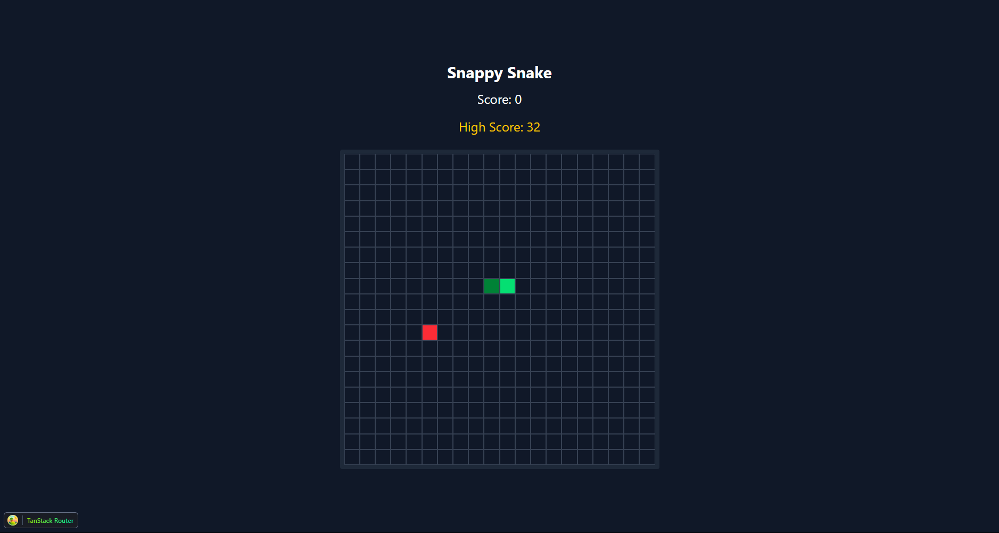

# 🐍 Snappy Snake

Snappy Snake is a modern, blazing-fast remake of the classic Snake game — built with **React**, **Zustand**, and **Tailwind CSS**. Designed to be responsive, customizable, and developer-friendly.

> Think Snake... but snappier.

---

## 🚀 Features

- 🎮 Two-player competitive mode (Player vs Bot/Player)
- 🎨 Custom name and color selection for each player before game start
- 📊 Win/Loss statistics tracking for both sides (with reset button)
- 🌀 Global state management via Zustand
- ⚡ Styled with Tailwind CSS
- 🧠 Clean and modular React components
- 💾 Local high score saving (via `localStorage`)
- 🍎 Multiple food items on the board
- 🧪 Easy to extend — add power-ups, skins, themes
- 🎬 Dark Souls-style animated "YOU DIED" game over screen (framer-motion)
- 📱 Fully responsive layout (mobile-friendly)

---

## 📦 Tech Stack

- [React](https://reactjs.org/)
- [Vite](https://vitejs.dev/)
- [Zustand](https://github.com/pmndrs/zustand)
- [Tailwind CSS](https://tailwindcss.com/)
- [TypeScript](https://www.typescriptlang.org/)
- [framer-motion](https://www.framer.com/motion/)

---

## 📸 Preview



---

## 🧑‍💻 Getting Started

### 1. Clone the repo

```bash
git clone https://github.com/Ra1nningDay/snappy-snake.git
cd snappy-snake
```

### 2. Install dependencies

```bash
pnpm install
```

### 3. Start the development server

```bash
pnpm run dev
```

---

## 🎮 Game Controls

| Action       | Key              |
| ------------ | ---------------- |
| Move Up      | ↑ / W            |
| Move Down    | ↓ / S            |
| Move Left    | ← / A            |
| Move Right   | → / D            |
| Pause/Resume | Spacebar         |
| Restart      | R (on game over) |

---

## 🧑‍🎨 Player Setup

- On first load, choose name and color for both Player1 and Player2 (Bot)
- Colors and names are used in-game and in stats

---

## 📊 Stats & Features

- Win/Loss stats for each player (resettable)
- High score saved locally
- Multiple food items on board
- Animated game over (Dark Souls style)

---

## 📁 Project Structure

```
/src
  /components   → UI elements
  /hooks        → useSnake, useGameLoop
  /store        → Zustand state
  /utils        → movement, collision detection
  /assets       → icons, sounds (optional)
```

---

## 🛣️ Roadmap (Optional Features)

- Touch controls for mobile
- Themes (Dark / Light / Retro)
- Power-ups and obstacles
- Global leaderboard with Firebase or Supabase
- Multiplayer mode (WebSocket-based)
- LLM-powered bot (API integration)

---
